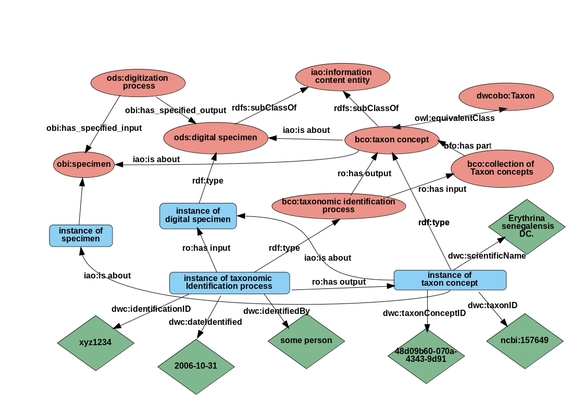

## openDS session DiSSCo AHM1

* Model of taxonomic identification process that gets information from a Digital Specimen and has as output a taxon concept that feeds back (iao:about) to Physical and Digital Specimen 
* Enables reasoning to track the provenance of taxonomic identification processes and link specimens to a taxon concepts (here simplified, many in the original model) 
* Scope: Only to demonstrate usefulness to build on and link to existing or currently developing semantic infrastructures like OBO, SEMAF, dwcobo approach etc etc
* Figure modified from Deck et al (2015) [doi:10.1186/s40793-015-0014-0](https://doi.org/10.1186/s40793-015-0014-0]

